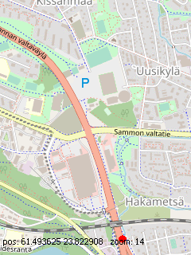

# S60Maps

Simple map for Symbian 9.X.

## Features
* Show map from default [OpenStreetMap](https://www.openstreetmap.org/) layer
* Retrieve phone location using internal GPS

## Keys
* Move: `arrows` or `2`, `4`, `6`, `8`
* Zoom: `1` and `3` or volume keys

## Download
Download and install `sis` or `sisx` package from [release page](../../../releases/latest/).

Must be signed or installed on unlocked phone.

## Task list
- [ ] Add support for other map layers/services (like OSM bicycle, OSM humanitarian, OpenTopoMap, etc...) and add ability to define custom providing tile\`s URLs
- [ ] Update old cached tiles

## Testing
Tested on:
* Nokia N95 8GB

If you can test it works (or not) on other s60-based phones, let me know.

## License
[GNU GPL v3.0](/LICENSE.txt)
