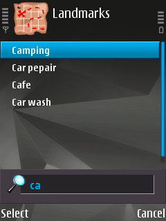

&nbsp;&nbsp;&nbsp;&nbsp;&nbsp;&nbsp;&nbsp;&nbsp;&nbsp;

# S60Maps

Map and navigation app for [*Symbian OS 9.x*](https://en.wikipedia.org/wiki/Symbian#Version_comparison) smartphones powered by [*Series S60 3rd/5th Edition*](https://en.wikipedia.org/wiki/S60_%28software_platform%29#Versions_and_supported_devices).

----

## Features

- Several map layers available:
  - [OpenStreetMap Standard layer](https://wiki.openstreetmap.org/wiki/Standard_tile_layer)
  - [Cycle Map layer](https://wiki.openstreetmap.org/wiki/OpenCycleMap)
  - [Transport Map layer](https://wiki.openstreetmap.org/wiki/Transport_Map)
  - [Humanitarian Map layer](https://wiki.openstreetmap.org/wiki/Humanitarian_map_style)
  - [OpenTopoMap](https://wiki.openstreetmap.org/wiki/OpenTopoMap)
  - [Esri World Imagery (Clarity) Beta](https://wiki.openstreetmap.org/wiki/Esri)
- Show phone location on the map using GPS
- Can work without GPS (no positioning)
- Map tiles caching (you can see previously viewed area without network connection)
- Display and edit landmarks
- Search
- Multilanguage:
  - English
  - Spanish
  - Galician
  - Portuguese
  - Russian
  - Polish
  - Hebrew
  - Latin American Spanish
  - Ukrainian
- Both keypad and touch ui supports
- Free and Open Source software

## Controls

### Keys

- Move: <kbd>←</kbd>/<kbd>↑</kbd>/<kbd>→</kbd>/<kbd>↓</kbd> (or <kbd>2</kbd>/<kbd>4</kbd>/<kbd>6</kbd>/<kbd>8</kbd>)
- Zoom in: <kbd>▲</kbd> volume key (or <kbd>1</kbd>)
- Zoom out: <kbd>▼</kbd> volume key (or <kbd>3</kbd>)
- Landmarks:
  - Create or rename: <kbd>5</kbd>
  - Delete: <kbd>C</kbd> (clear key)

### Touchscreen

- Touch *top* / *bottom* / *left* / *right side of the screen* — to move *up* / *down* / *left* / *right*
- Touch *and hold* — to move continuously
- Swipe *left* / *right* — to *zoom out* / *zoom in*
- Swipe *up* / *down* — to *show* / *hide softkeys* (on-screen <kbd>Options</kbd> & <kbd>Exit</kbd>)

## Screenshots

     
## Supported devices

This software was tested on:

- Smarthones:
  - `OK` [Nokia 808](https://en.wikipedia.org/wiki/Nokia_808_PureView) (thanks to [WunderWungiel](https://github.com/WunderWungiel)) 
  - `OK` [Nokia 5530 XM](https://en.wikipedia.org/wiki/Nokia_5530_XpressMusic) (thanks to [Baranovskiy Konstantin](https://github.com/baranovskiykonstantin))
  - `OK` [Nokia 5800](https://en.wikipedia.org/wiki/Nokia_5800_XpressMusic) (thanks to [fedor4ever](https://github.com/fedor4ever))
  - `OK` [Nokia C5-00 5MP](https://en.wikipedia.org/wiki/Nokia_C5-00) (thanks to [Men770](https://github.com/Men770))
  - `OK` [Nokia E52](https://en.wikipedia.org/wiki/Nokia_E52/E55) (thanks to [Fizolas](https://github.com/fizolas))
  - `OK` [Nokia E63](https://en.wikipedia.org/wiki/Nokia_E63) (thanks to [Fizolas](https://github.com/fizolas))
  - `OK` [Nokia E71](https://en.wikipedia.org/wiki/Nokia_E71) (thanks to [misheu12](https://github.com/misheu12))
  - `OK` [Nokia E72](https://en.wikipedia.org/wiki/Nokia_E72) (thanks to [Fizolas](https://github.com/fizolas))
  - `OK` [Nokia N8](https://en.wikipedia.org/wiki/Nokia_N8) (thanks to Alistair Inglis)
  - `OK` [Nokia N95 8GB](https://en.wikipedia.org/wiki/Nokia_N95#Variations) (my phone)
  - `OK` [Samsung SGH-i550](https://www.phonearena.com/phones/Samsung-SGH-i550_id2345) (thanks to [Ilya Vysotsky](https://github.com/Computershik73))
- Emulators:
  - `FAILED` [EKA2L1](https://github.com/EKA2L1/EKA2L1) (here is [issue thread](https://github.com/EKA2L1/EKA2L1/issues/231))

> **NOTE:** If you can test it works (or not) on other Series S60 devices or emulators, let me know. Also send me some screenshots in order to check a look on different sizes/orientations.

## Download

- Download and install `*.sis` or `*.sisx` (*unsigned!*) package from [release page](../../../releases/latest/).
- If your smartphone is locked (by default):
  - Sign package with developer certificate ([details](https://digipassion.com/signing-sissisx-files-for-symbian-s60/));
  - Install already signed package on your smartphone.
- If your smartphone is unlocked ('rooted') you may install provided unsigned package directly.

## Technical details

All data stored in directory `E:\Data\S60Maps\` (**note:** E drive used regardles of on which drive program installed). Map cache located in `E:\Data\S60Maps\cache\_PAlbTN\<map service>\` directory.

Settings store in `store.dat` file. If you have problems with application to run, try to delete this file and run again.

S60Maps uses phone's landmark database and all of them will be accessed within the application. New landmarks will be added to `S60Maps` category.

## SSL/TLS/HTTPS

Some map providers (Humanitarian and OpenTopoMap) require SSL/TLS for download tiles. This is a problem for legacy Symbian devices, but there are 2 solutions.

### Enable TLS support on system level

Not so long ago (2024 year) one person make TLS 1.2/1.3 support for Symbian 9.1 and later. Got to https://nnproject.cc/tls/ for more info and installation instructions.

After patch installed you need to **disable** "HTTPS proxy" option in s60maps settings.

### Use https proxy

This solution is easier and used by default. All http**s** requests pass via http proxy server. Make sure option "HTTPS proxy" is **enabled** in s60maps settings.

## How to build

Read [docs/COMPILING.md](/docs/COMPILING.md)

## Roadmap

- [x] Add support for other map layers and WMS services (like OSM bicycle, OSM humanitarian, OpenTopoMap, etc...) 
- [ ] Add ability to define custom map layers providing tile\`s URLs
- [x] Update old cached tiles **(done: manually for viewed area)**
- [x] Display and edit landmarks
- [x] Search (using [Nominatim](https://nominatim.openstreetmap.org/))
- [x] Show satellites info (amount, signal strength, etc...)
- [ ] Offline maps (zipped set of PNGs)

## License

This is Open Source software licensed under [GNU GPL v3.0](/LICENSE.txt)

## Donate

- PayPal: megabyte1024@yandex.com
- ETH Ethereum / Tether USDT: 0xB14C877b2eAF7E3b4b49df25039122C0545edA74
- Webmoney WMZ: Z598881055273
- Sberbank card: 5469 4009 8490 5476

## See also

- [About OpenStreetMap](https://wiki.openstreetmap.org/wiki/About_OpenStreetMap)
  - [Symbian software on OpenStreetMap Wiki](https://wiki.openstreetmap.org/wiki/Symbian)
- [GPS Track recorder for Symbian OS](https://github.com/artem78/s60-gps-tracker#readme)
- [Accuracy of GNSS data](https://wiki.openstreetmap.org/wiki/Accuracy_of_GNSS_data)
- [MahoMaps - Yandex.Maps client for Symbian OS](https://github.com/mahomaps/mm-v1)
