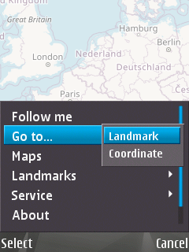

# S60Maps

Simple map and navigation app for [*Symbian OS 9.x*](https://en.wikipedia.org/wiki/Symbian#Version_comparison) smartphones powered by [*Series S60 3rd/5th Edition*](https://en.wikipedia.org/wiki/S60_%28software_platform%29#Versions_and_supported_devices).
  
- [Features](#features)
- [Controls](#controls)
  - [Keys](#keys)
  - [Touchscreen](#touchscreen)
- [Screenshots](#screenshots)
- [Supported Devices](#supported-devices)
- [DOWNLOAD](#download)
- [ROADMAP](#roadmap)
- [LICENSE](#license)

----

## Features

- Show map from default [OpenStreetMap](https://www.openstreetmap.org/) layer
- Retrieve phone location using internal GPS
- **Offline mode** - all downloaded tiles save in cache on disk and you can view them later without network connection needed

## Controls

### Keys

- Move: <kbd>←</kbd>/<kbd>↑</kbd>/<kbd>→</kbd>/<kbd>↓</kbd> or <kbd>2</kbd>/<kbd>4</kbd>/<kbd>6</kbd>/<kbd>8</kbd>
- Zoom: <kbd>1</kbd> (zoom in) and <kbd>3</kbd> (zoom out) or volume keys

### Touchscreen

- Touch top/bottom/left/right side of the screen to move up/down/left/right
- Touch and hold to move continuously
- Swipe left/right to zoom out/in
- Swipe up/down to show/hide softkeys (on-screen <kbd>Options</kbd> & <kbd>Exit</kbd>)

## Screenshots

   

## Supported Devices

- Smarthones:
  - `OK` [Nokia N95 8GB](https://en.wikipedia.org/wiki/Nokia_N95#Variations)
  - `OK` [Nokia 5530 XM](https://en.wikipedia.org/wiki/Nokia_5530_XpressMusic) (thanks to [baranovskiykonstantin](https://github.com/baranovskiykonstantin))
- Emulators:
  - `FAILED` [EKA2L1](https://github.com/EKA2L1/EKA2L1) (here is [issue thread](https://github.com/EKA2L1/EKA2L1/issues/231))

> **NOTE:** If you can test it works (or not) on other Series S60 devices or emulators, let me know.

## DOWNLOAD

Download and install `sis` or `sisx` package from [release page](../../../releases/latest/).

Must be signed or installed on unlocked phone.

## ROADMAP

- [ ] Add support for other map layers and WMS services (like OSM bicycle, OSM humanitarian, OpenTopoMap, etc...) and add ability to define custom providing tile\`s URLs
- [ ] Update old cached tiles
- [ ] Display landmarks
- [ ] Search (using [Nominatim](https://nominatim.openstreetmap.org/))
- [ ] Show satellites info (amount, signal strength, etc...)

## LICENSE

[GNU GPL v3.0](/LICENSE.txt)
