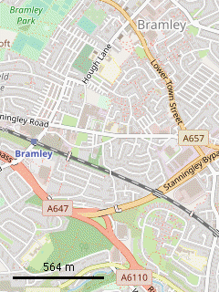

# S60Maps

Simple map and navigation app for [*Symbian OS 9.x*](https://en.wikipedia.org/wiki/Symbian#Version_comparison) smartphones powered by [*Series S60 3rd/5th Edition*](https://en.wikipedia.org/wiki/S60_%28software_platform%29#Versions_and_supported_devices).
  
<!--
- [Features](#features)
- [Controls](#controls)
  - [Keys](#keys)
  - [Touchscreen](#touchscreen)
- [Screenshots](#screenshots)
- [Supported devices](#supported-devices)
- [Download](#download)
- [Technical details](#technical-details)
- [Roadmap](#roadmap)
- [LICENSE](#license)
- [See also](#see-also)
-->
----

## Features

- Show different map layers: [OpenStreetMap Standard](https://www.openstreetmap.org/), [OpenCycleMap](https://wiki.openstreetmap.org/wiki/OpenCycleMap), [Transport Map](https://wiki.openstreetmap.org/wiki/Transport_Map) and [Humanitarian Map](https://wiki.openstreetmap.org/wiki/Humanitarian_map_style)
- Retrieve and show phone location using internal GPS
- Can work without GPS
- **Offline mode** - all downloaded tiles save in cache on disk and you can view them later without network connection needed

## Controls

### Keys

- Move: <kbd>←</kbd>/<kbd>↑</kbd>/<kbd>→</kbd>/<kbd>↓</kbd> (or <kbd>2</kbd>/<kbd>4</kbd>/<kbd>6</kbd>/<kbd>8</kbd>)
- Zoom in: <kbd>▲</kbd> volume key (or <kbd>1</kbd>)
- Zoom out: <kbd>▼</kbd> volume key (or <kbd>3</kbd>)

### Touchscreen

- Touch *top* / *bottom* / *left* / *right side of the screen* — to move *up* / *down* / *left* / *right*
- Touch *and hold* — to move continuously
- Swipe *left* / *right* — to *zoom out* / *zoom in*
- Swipe *up* / *down* — to *show* / *hide softkeys* (on-screen <kbd>Options</kbd> & <kbd>Exit</kbd>)

## Screenshots

     

## Supported devices

This software was tested on:

- Smarthones:
  - `OK` [Nokia 5530 XM](https://en.wikipedia.org/wiki/Nokia_5530_XpressMusic) (thanks to [baranovskiykonstantin](https://github.com/baranovskiykonstantin))
  - `OK` [Nokia 5800](https://en.wikipedia.org/wiki/Nokia_5800_XpressMusic) (thanks to [fedor4ever](https://github.com/fedor4ever))
  - `OK` [Nokia C5-00 5MP](https://en.wikipedia.org/wiki/Nokia_C5-00) (thanks to [Men770](https://github.com/Men770))
  - `OK` [Nokia E63](https://en.wikipedia.org/wiki/Nokia_E63) (thanks to [Fizolas](https://github.com/fizolas))
  - `OK` [Nokia E71](https://en.wikipedia.org/wiki/Nokia_E71) (thanks to [misheu12](https://github.com/misheu12))
  - `OK` [Nokia E72](https://en.wikipedia.org/wiki/Nokia_E72) (thanks to [Fizolas](https://github.com/fizolas))
  - `OK` [Nokia N8](https://en.wikipedia.org/wiki/Nokia_N8) (thanks to Alistair Inglis)
  - `OK` [Nokia N95 8GB](https://en.wikipedia.org/wiki/Nokia_N95#Variations)
- Emulators:
  - `FAILED` [EKA2L1](https://github.com/EKA2L1/EKA2L1) (here is [issue thread](https://github.com/EKA2L1/EKA2L1/issues/231))

> **NOTE:** If you can test it works (or not) on other Series S60 devices or emulators, let me know. Also send me some screenshots in order to check a look on different sizes/orientations.

## Download

- Download and install `*.sis` or `*.sisx` (*unsigned!*) package from [release page](../../../releases/latest/).
- If your smartphone is locked (by default):
  - Sign package with developer certificate ([details](https://digipassion.com/signing-sissisx-files-for-symbian-s60/));
  - Install already signed package on your smartphone.
- If your smartphone is unlocked ('rooted') you may install provided unsigned package directly.

## Technical details

All data stored in directory `E:\Data\S60Maps\` (**note:** E drive used regardles of on which drive program installed). Map cache located in `E:\Data\S60Maps\cache\_PAlbTN\<map service>\` directory.

Settings store in `store.dat` file. If you have problems with application to run, try to delete this file and run again.

## Roadmap

- [x] Add support for other map layers and WMS services (like OSM bicycle, OSM humanitarian, OpenTopoMap, etc...) 
- [ ] Add ability to define custom map layers providing tile\`s URLs
- [ ] Update old cached tiles
- [ ] Display landmarks
- [ ] Search (using [Nominatim](https://nominatim.openstreetmap.org/))
- [ ] Show satellites info (amount, signal strength, etc...)

## LICENSE

[GNU GPL v3.0](/LICENSE.txt)

## See also

- [OpenStreetMap](https://wiki.openstreetmap.org/wiki/About_OpenStreetMap)
- [GPS Track recorder for Symbian OS](https://github.com/artem78/s60-gps-tracker#readme)
